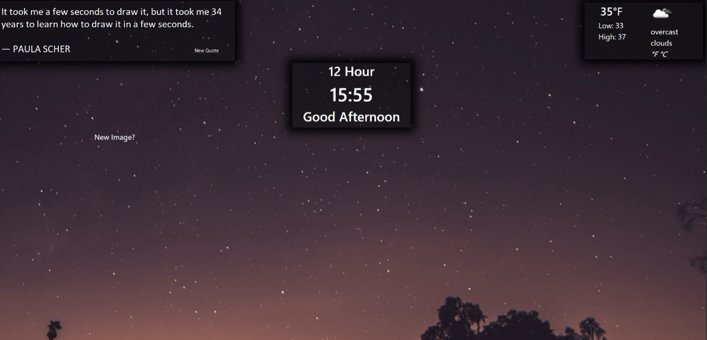
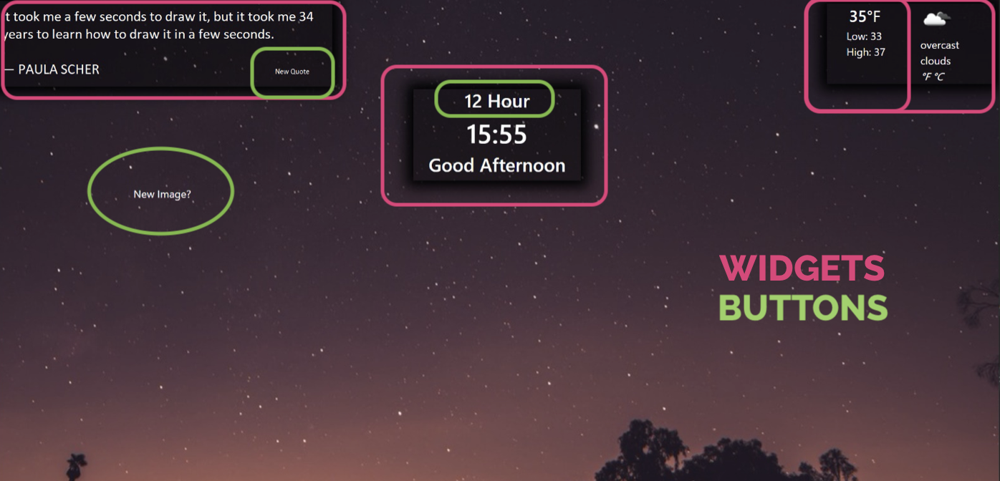
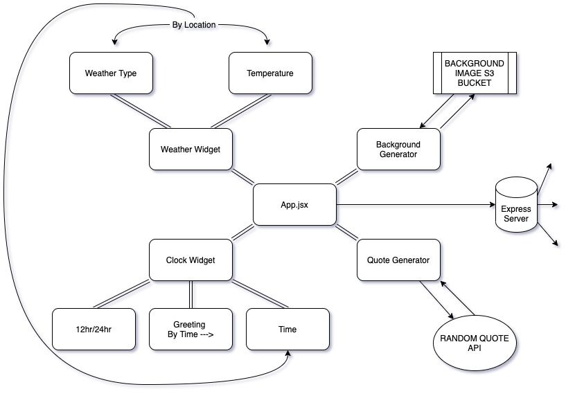

# Hello In Time Tech!

I had a lot of fun putting this application together and I am excited to demo it for you!

# The Goal of the INSPIRE app

Per your intructions, below is the goal for this application and what the final product should look like.

### Part 1 – Responsibilities

It is your responsibility to render each piece of the data from the services out to the screen with real time accuracy (Clock will tick if the minute turns).

### Part 2 – Requirements

> Visualization

1. The data from the services are each rendered. Quote, Image, Weather, and Clock
2. The image should fill the screen with the widgets overlaying the photo

> Functionality

1. The clock should display your current time and progress forward if a minute passes (no need to account for time zones)
2. The quote will refresh with page load
3. The weather will be accurate for your location
4. No need to base it off GPS/computer location

### Part 3 - Prettify

The positioning of elements on the page is not the absolute most crucial thing for this application however we do want to see some thought put into the layout. Copy the image above if you’d like.

### Stretch Goals

* On hover the quote should show the author of the quote and disappear when not hovered over
* Change the message from Good Morning to Good Afternoon, Evening as appropriate.
  * Morning = 6am-12pm
  * Afternoon = 12-5pm
  * Evening = 5-10pm
  * Night = 10pm-6am
* Allow the user to toggle the clock from, 12hr to military time.
* Include an Icon to show what the weather is sunny/cloudy/rainy
* Add a button to cycle to next quote/picture

# Breaking it Down

After breaking down the example image I have a pretty clear idea of how to proceed and built a flowchart to map out my route.

The Project has been completed to the requirements and you can download it to run on your local machine.

# Get the App

You can run the app on your local machine by following the instructions below.

### Step One: Git the Repo

### Step Two: Download the Packages

### Step Three: Spin Her Up

My Final Product came out pretty well, if I do say so myself. Let me take you through a tour of the features...

Thats pretty much it, thanks for taking the time to walk through this with me and have a fantastic day!